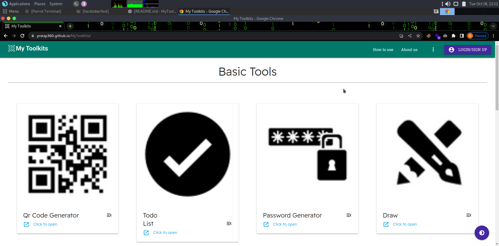

# My Toolskit - Progressive web application (PWA)


## Project overview 

- This repository consists of files required to deploy a ___Web App or PWA___ created with [Materialize Css](https://materializecss.com/)  

- Basically My Project is a Type of Web app (Contains Tools)in which user can interacts with Different Tools Such as <br>
   >1.Qr Code Generator <br>
   >2.Password Generator<br>
   >3.Todo list <br>
   >4.Draw tool<br>
  And many more to Come 


# How to contribute in this repo check here 
## [Contribution.md](./CONTRIBUTING.md)
<br>

# Screenshot 

## - Home page 




To know about PWA You can visit this [site](https://web.dev/progressive-web-apps/)


<!-- ## this is under developement state !  -->

# Steps to Follow :point_down: 

### Fork this repository

Fork this repository by clicking on the fork button on the top of this page. This will create a copy of this repository in your account. 

### Clone the repository

Now clone the forked repository to your system. Go to your GitHub account, open the forked repository, click on the code button and then clone the repository.

_if you want to use the terminal, use the following commands_
after you fork the repository , open the terminal type the given command

```
git clone https://github.com/{your-github-username}/
MyToolKits
```

### Create a branch

Then create a branch on your local repository to solve a problem.

_terminal commands_

```
git checkout -b your_new_branch_name
```

### Add & commit

Add your changes(folder) to that branch. <br/>
Make necessary changes and commit those changes. <br/>
_Add your name in contributors list in `readme.md`_

_terminal commands_

```
git add .
git commit -m "your-commit-message"
```

### Push changes to GitHub

Finally push your local repository to remote repository
Compare & Submit a Pull Request

_terminal commands_

```
git push origin <branch-name>
```

Then go to your repository on GitHub, you'll see a Compare & pull request button. Click on that button.

Now submit the pull request.

### Star this repository

If you had fun while contributing to this project, then don't forget to give this project a star.


